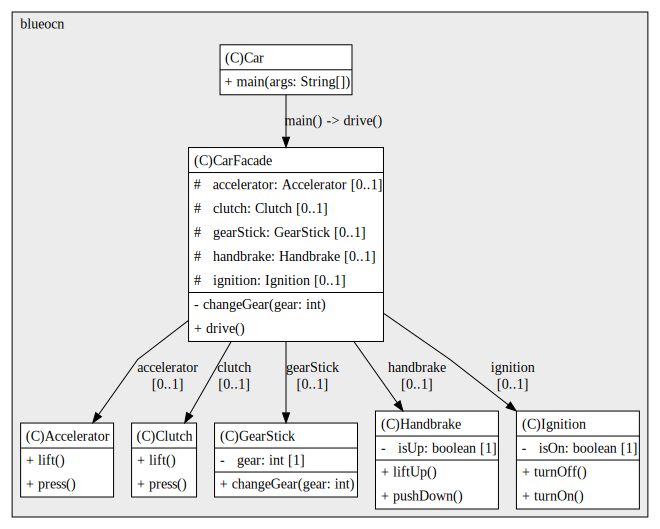

## Structural Design Patterns: Facade

---

# Challenge
Let's have a look at our next challenge exercise. This is an app that simulates driving a car, with a manual gear box. It's quite a simplistic representation, to keep this exercise simple. And you don't need to know anything at all about how a car works in real life, to do this one. There are classes each of the components needed for driving a car. 

Called accelerator, clutch, gear stick, hand brake, and ignition. They all have methods that simulates there functionality, in a real car. For example, in the accelerator class, there are methods called press and lift. And these just print out messages to the console saying, what's happening. So, for example, the press method says, "Pressing accelerator down." 

In the car class, there is a main method. In here I've created an object for each of the components. And then, underneath I've called the methods in the order they are needed, to drive a car. If I run the app. I can see it print out in the console, the different steps, such as, turning the ignition on, pressing the clutch down, changing to gear one, and so on. 

This exercise is to create a facade class, so that the functionality, for driving the car, is moved out of the car class. Good luck, and have fun.

# Solution
Car is the application entry point that uses CarFacade to start driving; Car calls CarFacade.drive() to perform the high-level operation. CarFacade is the Facade: it composes subsystem objects (Accelerator, Clutch, GearStick, Handbrake, Ignition) as private fields and exposes simple operations drive() and changeGear(gear) that coordinate those subsystems.

Accelerator, Clutch, GearStick, Handbrake, and Ignition are independent subsystem classes that encapsulate each domain responsibility and provide low-level actions such as press/lift, changeGear, liftUp/pushDown, and turnOn/turnOff. The Facade delegates ordered calls to subsystems, hides sequencing and error-handling details, and preserves subsystem independence so they remain usable and testable on their own.

Clients depend only on CarFacade, reducing coupling and simplifying the API. This arrangement centralizes orchestration, improves readability of Car, eases testing via single replaceable façade or mocked subsystems, and localizes changes when subsystem behavior evolves, minimizing ripple effects to clients.